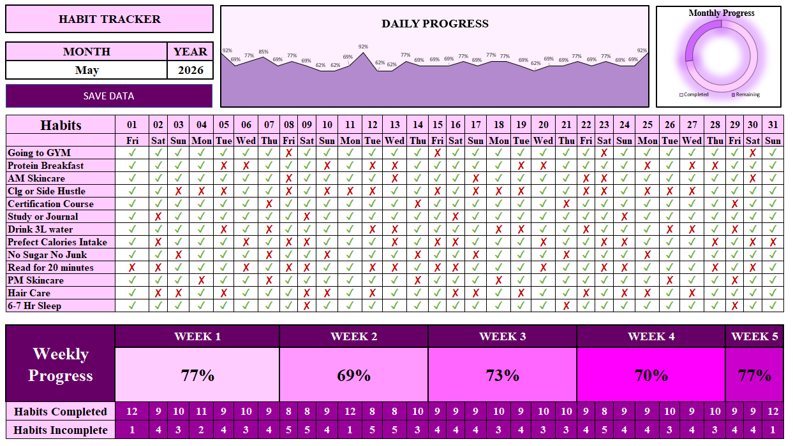

# Monthly Habit Tracker Dashboard

## Project Overview

The Monthly Habit Tracker Dashboard is an Excel-based productivity analytics solution developed to track daily habits, monitor consistency, and evaluate personal performance through an interactive dashboard. The project integrates VBA automation, KPI monitoring, and data visualization techniques to transform raw habit data into actionable insights.

## Dashboard Preview

## Project Highlights

* Automated habit tracking using VBA
* Interactive dashboard with performance visualizations
* KPI-driven monitoring of productivity and consistency
* Dynamic charts for trend analysis and progress tracking
* Automated calculations and reporting
* User-friendly interface for efficient habit management

## Tools & Technologies

* Microsoft Excel
* VBA (Visual Basic for Applications)
* Dashboard Development
* KPI Analysis
* Data Visualization
* Chart-Based Reporting

## Business Impact

This dashboard enables users to analyze habit patterns, measure goal achievement, and make data-driven decisions for continuous self-improvement. By automating calculations and presenting insights through KPIs and visual reports, the solution enhances productivity tracking and performance evaluation.

## Author

**Eha Patil**
B.E – Computer Science Engineering (AI & ML)
